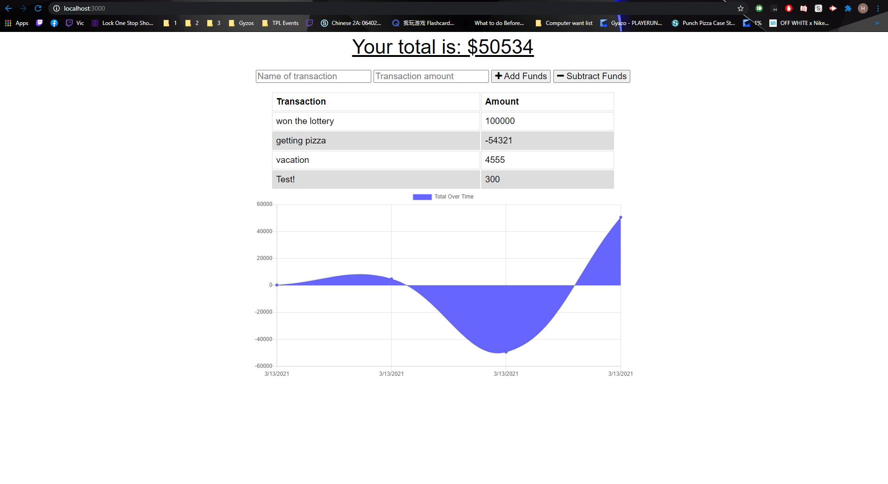

# Online and Offline Budget Tracker

## Description
 For this application the user is given the ability to add and subtract funds and track them using a graph. The user is able to able to use this offline and online and will update as soon as it goes online to both versions.

## To test:

The user should :

  * NPM I to install npm packages

  * then run the command 'node server.js'.

  * Heroku deployment can also be checked out  <a href="https://burger-app-bcs-hayden.herokuapp.com/">here</a>
  

## Github repo and deployment link:

<a href="https://github.com/H-garr/budgettracker">Repo</a>
<a href="https://h-garr.github.io/budgettracker">Deployment Link</a>

## Questions and Concerns:
Contact me at :
<a href="https://hagarrard@gmail.com">hagarrard@gmail.com</a>

## Walkthrough Video & Picture: 

<a href="https://drive.google.com/file/d/1apKk_1Q58u9-6RpsRE_QevwEYUPZhNs_/view">Video Here</a>
- - -
© 2021 Trilogy Education Services, LLC, a 2U, Inc. brand. Confidential and Proprietary. All Rights Reserved.